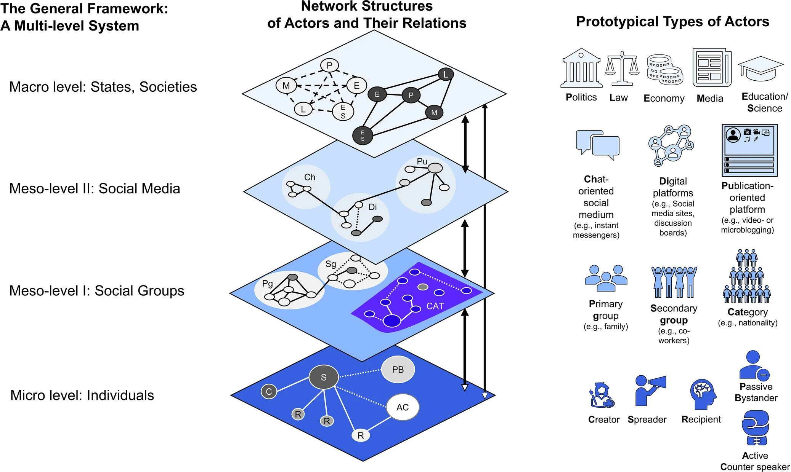
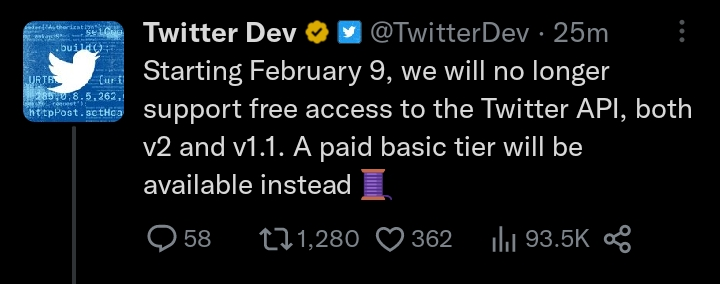
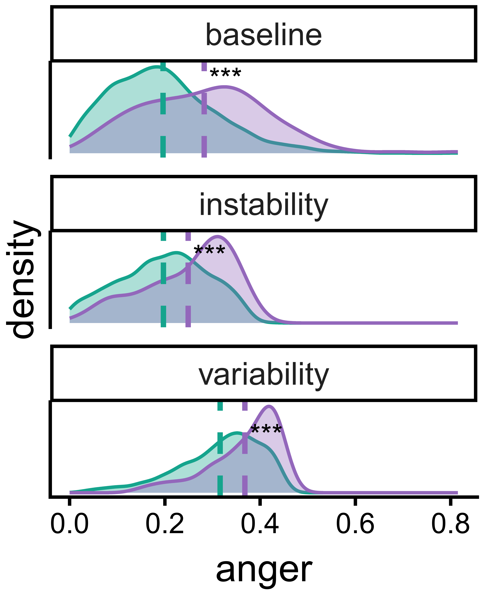

## The temporal nature of emotions and misinformation

- **Emotions**1 and **misinformation**2 are widely assumed to **fuel each other**

    - Instances of heightened emotions are linked to misinformation acceptance [in experiments: @martelRelianceEmotionPromotes2020; @greensteinAngerIncreasesSusceptibility2020] and conspiracy belief [longitudinal surveys: @albathDoesLowerPsychological2024]
        
    - In turn, misinformation is followed by emotional experiences when it contradicts or confirms beliefs [@eckerPsychologicalDriversMisinformation2022; @luhringEmotionsMisinformationStudies2023]

$\rightarrow$ The relationship exists **at the individual level**

$\rightarrow$ The relationship seems **bi-directional**, hence, it may be important to examine the **temporal dynamics** 

::: footer
1Based on circumplex model [@russellCircumplexModelAffect1980] and constructivist view [@lindquistFunctionalArchitectureHuman2012]

2False information without intention to deceive [@wardleInformationDisorderInterdisciplinary2017]
:::

::: {.notes}

When misinformation circulates on social media, emotions often spread alongside it and the two have been thought to mutually reinforce each other. 

And indeed, experiments and panel surveys link heightened emotions to misinformation acceptance and conspiracy belief.

But studies also show that misinformation itself is followed by emotional experiences when it contracts or confirms pre-existing beliefs.

This suggests a bidirectional relationship at the individual level and highlights that understanding it requires attention to the temporal dynamics, both the order of effects and the persistence over time. 

[CLICK: NEXT SLIDE]

:::

---

## Understanding misinformation spread as operating at multiple levels

- At the **collective level**, misinformation represents only a fraction of news [see @budakMisunderstandingHarmsOnline2024 for a discussion]

- But individual-level dynamics can ripple through the broader system **generating macro-level consequences**, including affective polarization [@jenkeAffectivePolarizationMisinformation2024] and loss of trust in institutions [@ognyanovaMisinformationActionFake2020]

<!-- Misinformation is linked to emotional dynamics and hate speech on social media [@luhringQuantifyingMisinfo2025; @moslehMisinformationHarmfulLanguage2024; @prollochsEmotionsOnlineRumor2021; @zolloEmotionalDynamicsAge2015] 
-->

$\rightarrow$ Aggregate patterns may **mask** or **contradict** individual-level mechanisms (*ecological fallacy*3)

::: footer

3*Ecological fallacy* = patterns observed at the aggregate  do not reflect (or may contradict) an individual

:::

::: notes

This relationship between misinformation and emotions operates across multiple levels of analysis, which has consequences for how we study it.

At the collective level, misinformation represents only a small fraction of overall news consumption on platforms. 

Yet individual-level dynamics can aggregate and ripple through the broader system, generating macro-level consequences such as hateful emotional dynamics on social media and erosion of trust in institutions.

The methodological implication is that aggregate patterns may mask, or in some cases contradict, the individual-level mechanisms that produce them, which is called the ecological fallacy: a relationship observed at the population level need not hold or reverse for any individual within it. 

Studying emotions and misinformation therefore requires examining both levels simultaneously, rather than treating findings from one as evidence about the other.

[NEXT SLIDE]

::: 

---

## Looking at different levels of analysis

 

::: {.columns}
::: {.column width="50%"}

**[Collective level]** Synchronized spikes around events but is that *mutual reinforcement* or just a *shared response* to the same shock?

 

**[Individual level]** Trait vs. state: does emotional *baseline* matter, or the *moment right before sharing*?

:::

::: {.column width="45%"}

:::
:::

::: notes

This multi-level perspective is increasingly recognized in the misinformation literature. 

Frischlich and colleagues, for instance, have recently argued that the complexity of misinformation extends across individual, group, and societal levels, and that single-level approaches cannot adequately capture its dynamics.

We adopt this perspective and look at the relationship between emotions and misinformation at two levels: the collective level, as synchronized responses aggregated across individuals on social media, and the level of each individual user over time.

[NEXT SLIDE]
:::

---

## Research questions {.center}

**RQ1 [Collective]:** Do misinformation and emotional expression **reinforce each other** at the aggregate level, or do they respond independently to external events?

**RQ2 [Individual]:** Do static emotional **traits**, **dynamics** (baseline, variability, instability, inertia), or momentary **states** predict whether a user engages with untrustworthy news?

::: notes
More precisely, the first research question asks whether misinformation sharing and emotional expression reinforce each other in the aggregate time series, or whether they respond independently to external events.

The second question then asks whether sharing of untrustworthy content is predicted by stable emotional traits, fluctuating emotions, or by momentary states in the time window immediately preceding sharing. 

[NEXT SLIDE]

:::

# Data and methods {.center}

::: notes
A few notes on the data and methods.

:::
---

## Data

- **~29,000 Austrian Twitter users**, located via Brandwatch4
- **Jan 2019 → Mar 2023** covers pre-pandemic, pandemic, and post-pandemic
- **~138 million tweets** after filtering (spam, media accounts, inactive users)
- Collected via academic API v2 just before the X transition

{fig-align="left" width=50%}

::: footer
4Documentation (February 16th, 2026):  [https://www.brandwatch.com/blog/faq-how-does-brandwatch-classify-location/](https://web.archive.org/web/20250216151058/https://www.brandwatch.com/blog/faq-how-does-brandwatch-classify-location/)

:::

::: notes

We analyze approximately 29,000 Twitter users geolocated in Austria, identified using Brandwatch's location classification algorithm.

The observation period runs from January 2019 to March 2023 spanning pre-pandemic, pandemic, and post-pandemic phases as well as several major global and domestic political events that we use to characterize collective dynamics.

After filtering for spam accounts, media outlets, and inactive profiles, the final dataset comprises around 138 million unique tweets and retweets.

The data was collected via the academic Twitter API in April and May of 2023, shortly before the free API access was closed.  

[NEXT]
:::

---

## Measurement

 

| Variable | How we measure it |
|---|---|
| News sharing | URL → NewsGuard domain match |
| **Untrustworthy** news | NewsGuard score < 60 |
| Partisan news | NewsGuard left/right label |
| **Anger / fear** | `pol_emo_emDeBERTa` [@widmannCreatingComparingDictionary2022] — German tweets only {fig-align="center" width="85%"} Figure 1. Area Under the Curve for emotion expressions (1,000 tweets). |

::: notes

Four key variables, all operationalized at the tweet level.

News sharing is identified by matching expanded URLs against the NewsGuard database, which rates roughly 11,000 news domains on a 0–100 trustworthiness scale. 

Untrustworthy news is operationalized as content from sources scoring below 60, the threshold NewsGuard itself uses to flag domains as failing basic journalistic criteria.

Partisan news is identified through NewsGuard's left and right bias labels.

Emotional expression in tweets is classified using pol_emo_emDeBERTa, a transformer model fine-tuned by Widmann and Wich on German-language political text. 

We focus on anger and fear because both are high-arousal, negative-valence emotions, and because both feature prominently in the experimental and survey literature linking emotions to misinformation acceptance. 

The ROC curves shown here indicate that classifier performance for both emotions compares well against our manual annotations.

[NEXT]
:::

---

## Two levels, two analytic strategies

::: {.columns}
::: {.column width="50%"}
**Collective (RQ1)**

- Daily proportions (1,551 days)
- ARIMA + structural-break detection
- **VAR(9)** with misinformation, anger, fear as endogenous
- News sharing & two structural breaks as exogenous controls
- Impulse-response + variance decomposition
:::

::: {.column width="50%"}
**Individual (RQ2)**

- Per-user emotional features [@houbenRelationShorttermEmotion2015]:
  - **baseline**, **variability**, **instability**, **inertia**
- Adjusted for irregular posting (weekly windows ≥ 10 tweets; hourly decay for inertia)
- Logistic regressions predicting any / partisan / untrustworthy news sharing
:::
:::

::: notes
At the collective level, we work with daily proportions over 1,551 days. 

ARIMA models identify structural breaks, which we control for as dummies in a vector autoregression with nine lags. 

Misinformation, anger, and fear are endogenous; overall news sharing and the structural breaks are exogenous. Impulse-response and variance decomposition then quantify cross-variable dynamics.

At the individual level, we extract three emotional features per user following Houben and colleagues to go beyond just a baseline and look into how emotions fluctuate: variability, instability, and inertia. 

Because users post irregularly, we estimate these within weekly windows and use exponential decay regression for the inertia parameter. 

The features then enter logistic regressions predicting whether a user ever shared any news, partisan news, or untrustworthy news.

:::

# Results at the collective level {.center}

::: notes

We start with the results at the collective level.

:::

---

## Tweet activity tracks major events

{fig-align="center" width=80%}

::: notes
Our data shows several spikes related to domestic or global crises, for example, COVID lockdowns or political scandals in Austria. 

In addition, we see in the bottom plot that untrustworthy news (in purple), in absolute terms, is rare (hovering around 0.1-0.3% of all tweets).

Interestingly, we see some structural breaks in summer 2022, which we control for as dummies.
:::

---

## VAR(9): emotions and misinformation move independently

::: {.columns}
::: {.column width="55%"}
{width=100%}
:::

::: {.column width="45%"}
- **Cross-variable effects all < 5%** at every forecast horizon
- Fear → anger is the only non-trivial cross-effect (~37% at 14 days)
- But misinformation ↔ emotions shows essentially **zero** cross-variable effects
:::
:::

::: notes
At the aggregate daily level, after controlling for total news activity and structural breaks, neither of the emotions move misinformation, or vice versa.

They all respond to the same external events.

:::

# Results at the individual level {.center}

---

## Anger traits predict untrustworthy sharing

::: {.columns}

::: {.column width="40%"}

 

- **Anger baseline, variability, instability** all elevate sharing of untrustworthy news (OR > 1.3)

- **Anger inertia** *reduces* it (OR < 1) shows high persistence ≠ high engagement

- Fear shows weaker, less consistent effects

:::

::: {.column width="60%"}

 

{fig-align="center" width=750%}

:::

:::

- But moment-to-moment emotions do **not** predict sharing

::: notes
At the individual level, anger baseline, variability and instability all predict untrustworthy news sharing, which is similar for fear but weaker. 

Inertia, so how sticky the emotion is reduces it, and emotional states directly before posting do not predict sharing.

So it's not just how much anger users express, it's how volatile that expression is. 

People who flare up (rather than stewing) share misinformation. 

[NEXT SLIDE]
:::

---

## But moment-to-moment emotions do **not** predict sharing {visibility="hidden"}

{fig-align="center" width=80%}

::: {.fragment .fade-in}
- Neither anger nor fear in the **1–24h before** sharing predicts an untrustworthy share
- No detectable change in emotional expression **after** sharing either
:::

---

## And only a motivated minority engages with untrustworthy news

::: columns

::: {.column width="50%"}

  

 

| Sharing | Users | Share |
|---|---:|---:|
| Any news | 24,367 | **83.5%** |
| Partisan news | 10,589 | 36.3% |
| **Untrustworthy news** | 4,104 | **14.1%** |

:::

::: {.column width="50%"}

 

::: {.r-stack}

::: {.fragment .fade-out fragment-index=1}

{fig-align="center" width="60%"}

:::

::: {.fragment fragment-index=1}

{fig-align="center" width="60%"}

:::

:::

:::

:::

::: notes
However, in our whole dataset, only ~14% of users ever share an untrustworthy source, and only 0.5% of users account for 80% of the untrustworthy news shared. 

[CLICK FOR FIGURE TO APPEAR]

These users tend to be higher in their baseline anger and they are also more volatile in their expression. 

[NEXT SLIDE]
:::

# Conclusion {.center}

::: notes
What this means

:::

---

## Selection, not contagion

::: {.columns}
::: {.column width="50%"}
**Aggregate level**

Events drive both emotions and misinformation, but they don't mutually reinforce each other.

$\rightarrow$ *Misinformation spreads through **exposure opportunities**.*
:::

::: {.column width="50%"}
**Individual level**

Stable emotional traits, and especially volatile anger, predict who engages.

$\rightarrow$ *Misinformation is shared through **selection** of vulnerable users.*
:::
:::

::: {.fragment}
 
 
**Emotional traits predict *who* shares. External events predict *when* it spreads.**

- **Platform-level:** rapid response and pre-bunking during predictable crises (the *when*)
- **User-level:** target users with high-anger, high-volatility profiles (the *who*)
:::

::: notes
Putting both levels of analysis together, a consistent picture emerges.

At the aggregate level, both emotions and misinformation respond to external events, but they do not amplify or reinforce each other.
The collective spread of misinformation is best understood as driven by these exposure events: when major events occur, more users encounter untrustworthy sources, and a subset of them share.

At the individual level, the picture is different. 
Stable emotional traits and in particular volatile, high-arousal anger predict which users are the ones that engage.

So misinformation spreads not through a general contagion at the population level, but primarily through selection at the individual level.

[CLICK]

So taken together, emotional traits predict who shares misinformation, and external events predict when it spreads.

This translates into interventions focusing on both rapid response and pre-bunking during predictable crises and targeting users with high-risk profiles. 

[NEXT]
:::

---

## Limitations

- Proportions, not raw counts, so compositional effects possible
- We measure emotional expression, not felt experience
- URL-based misinformation misses text/meme/screenshot false claims
- Austrian Twitter does not generalize to other platforms/contexts

::: notes
Limitations of this study relate to the measurement of emotions and URL-based misinformation. 

Beyond that, Austrian Twitter of course does not generalize to other platforms and contexts. 

[If pressed on the URL limitation: note that text-only misinformation is probably *more* emotionally charged, so we may be underestimating the effect.]
:::

---

## Where next {.center visibility="hidden"} 

1. **Supersharers**: who are the ~1% driving most untrustworthy sharing?
2. **Fine-grained timing**: what happens in the minutes around a misinformation share?
3. **Cross-platform / cross-country** replication
4. Does sharing misinformation *satisfy* a psychological need, or *reinforce* it?

---

## Thank you! {.center}

For questions, email jula.luehring@gesis.org :-)

Pre-registration: [osf.io/xejdw](https://osf.io/xejdw)

::: {.notes}
For questions, reach out to Jula. 

[possibly add this if I manage to do it before ICA:

Code & data: [osf.io/mvc6b](https://osf.io/mvc6b)

]

:::

# Backup slides {.center}

::: notes

The slides below are for likely Q&A topics.

You can navigate to them with the slide number menu or press `m` in reveal.js!

:::

---

## Backup: structural breaks in untrustworthy news

Two unexplained step-changes (July 1 and Aug 28, 2022) in the untrustworthy proportion.
Cumulative shift: +0.11 percentage points. Modelled as dummies in the VAR.

::: notes
Couldn't find the reason for the structural break, not in hashtags, changes in the selection and ratings of NewsGuard domains, or users joining/leaving our panel.
The Musk acquisition was later (October), so it's not that either. We control for it and move on but ideas welcome!!

:::

---

## Backup: emotional dynamics from irregular data

The Houben et al. (2015) metrics assume equally-spaced measurements but tweets aren't.

- **Variability / instability**: weekly windows with ≥ 10 tweets, then averaged across weeks
- **Inertia**: exponential decay regression → hourly autocorrelation $\phi_{hour}$

---

## Backup: why VAR(9)?

| Lags | AIC | BIC | Portmanteau |
|---:|---:|---:|---:|
| 7 | 5191.0 | **5591.7** | <.001 |
| 8 | 5182.2 | 5630.9 | <.001 |
| **9** | **5151.1** | 5647.8 | .002 |

Chose 9: lowest AIC, best residual properties, stability max-eigenvalue 0.972.

---

## Backup: variance decomposition

At 14-day horizon:

- Misinformation: 95.3% self-explained
- Fear: 97.2% self-explained
- Anger: ~63% self-explained (37% from fear shocks)
- **Misinformation ↔ emotions cross-effects: all < 5%**

## References